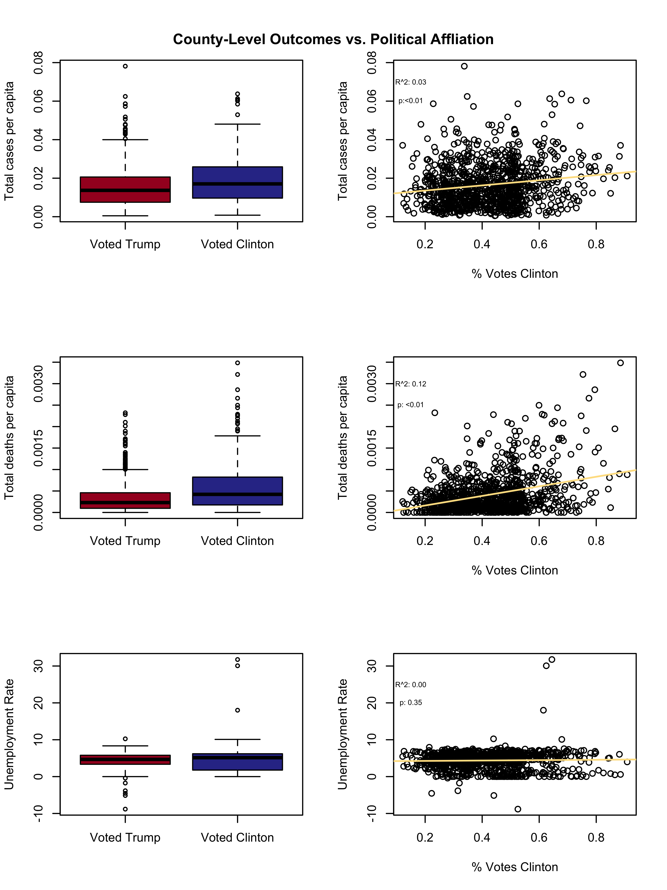
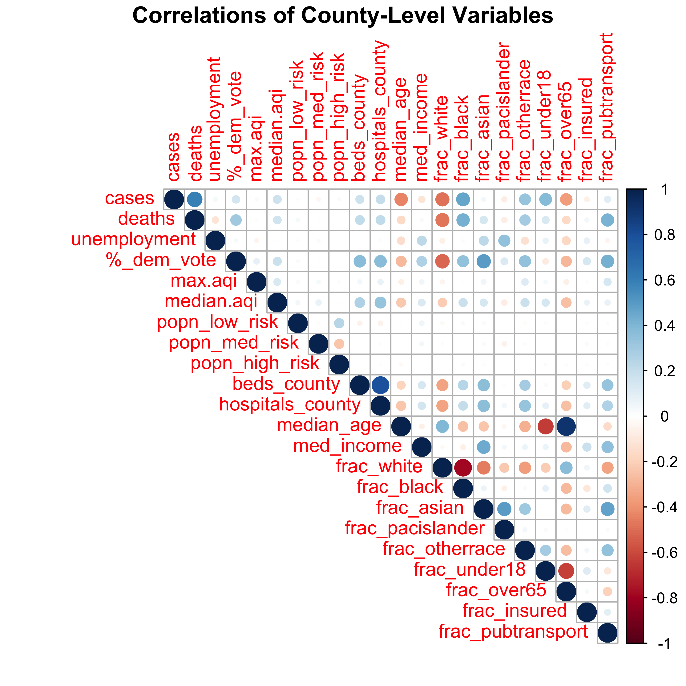
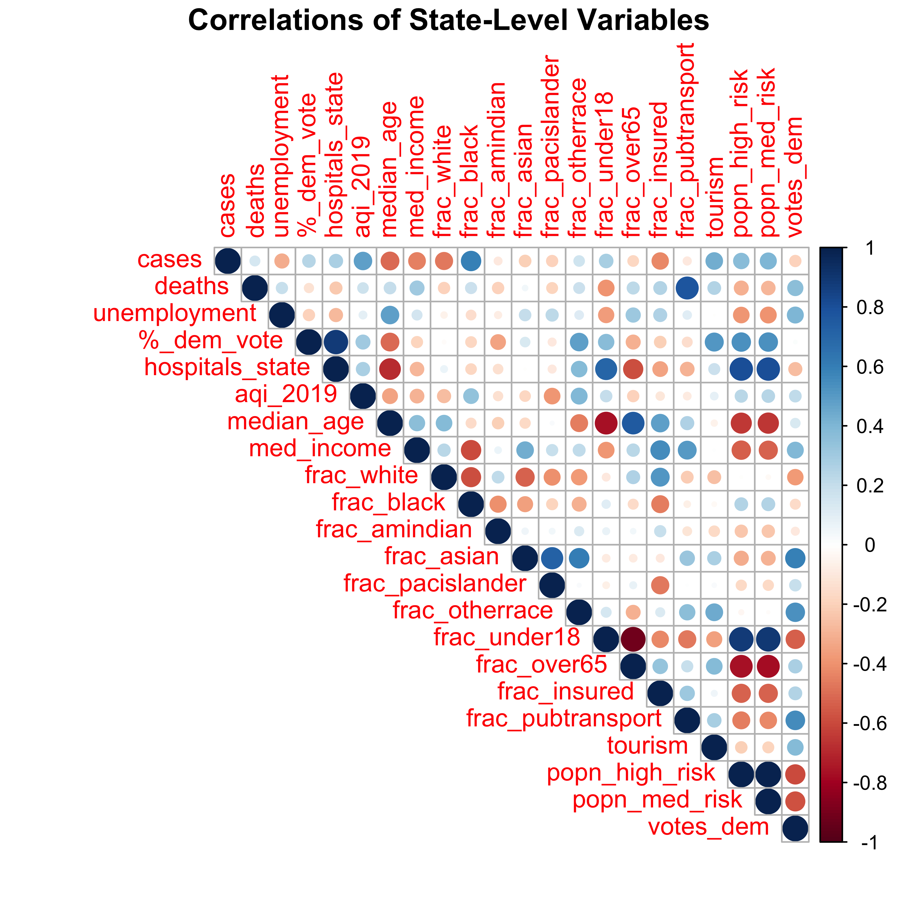

# Analysis methods

*Have places that voted for Trump in 2016 had better COVID-19 outcomes than those that voted for Clinton?*

#### Is there truth to Trump's statement? 

We started our analysis by seeing if there was an obvious pattern between COVID19 outcomes and party affiliation. Here, we defined party affiliation as a binary category (majority voted for Trump vs. majority voted for Clinton) and by the proportion of Clinton voters during the 2016 election. We created boxplots and scatterplots to visualize this pattern and ran a regression to see if there were any significant patterns at the county and state levels. These preliminary analyses were used to gauge, at a very surface level, if there is discrepancy in COVID-19 cases and deaths per capita among regions of the U.S. in which Trump or Clinton won the vote.

*State-Level Boxplots comparing COVID-19 outcomes and polical affiliation.*

No strong relationships between party affiliation and COVID19 outcomes were found. In some cases, “blue” counties or states showed a significant difference. However, given the weak pattern (<12% of the variation in COVID19 outcomes explained), it is unlikely that party affiliation plays a significant role in determining COVID-19 outcomes.

 

*County-Level Boxplots comparing COVID-19 outcomes and polical affiliation.*

The impacts of COVID-19 span much farther than those who have been infected; millions of people in the United States are feeling the adverse economic impacts of the disease. Corrplots and regression models were used to analyze associations between health, demographic, environmental, and social factors and COVID-19. Unemployment rates in each county and state were also assessed to quantify the negative economic impacts of the virus, given the unique social, demographic, spatial, and environmental factors in each county and state.

#### What other factors could be impacting COVID-19 statistics? 

The impacts of COVID-19 span much farther than those who have been infected; millions of people in the United States are feeling the adverse economic impacts of the disease. Correlations between these three outcomes (unemployment, death rate and positive cases) and voting data may be attributed to other covariates in a given location. For example, states that voted for Trump tended to be more rural than those that voted for Clinton. Therefore, we collected a dataset of covariates that might cause this pattern. They included: government interventions as a response to COVID-19, hospital capacities, community resilience, commercial flight arrivals, air quality, and demographic statistics.

After acquiring [these data](https://pages.github.ncsu.edu/chaedri/Data-Challenge-GIS713/data) from several reliable sources, corrplots were developed to compare the relative correlations that the factors have with COVID-19 cases and mortalities. Several of the covariates were significantly and positively (blue) or negatively (red) correlated with the three COVID19 outcomes. The strength of the relationship corresponds with the depth of the color and no color indicates no significant relationship.

 

*County-Level Correlellograms between possible COVID-19 outcome covariates.*

 

*State-Level Correlellograms between possible COVID-19 outcome covariates.*

To analyze which of these significant covariates best explained the variation of COVID19 outcomes at state and county levels, we used additional modeling approaches, includin regression analysis and model selection, random forest, and spatial autocorrelation.

##### Find our analysis, data and methods on github: 
 
 [GitHub](https://github.ncsu.edu/chaedri/Data-Challenge-GIS713)
