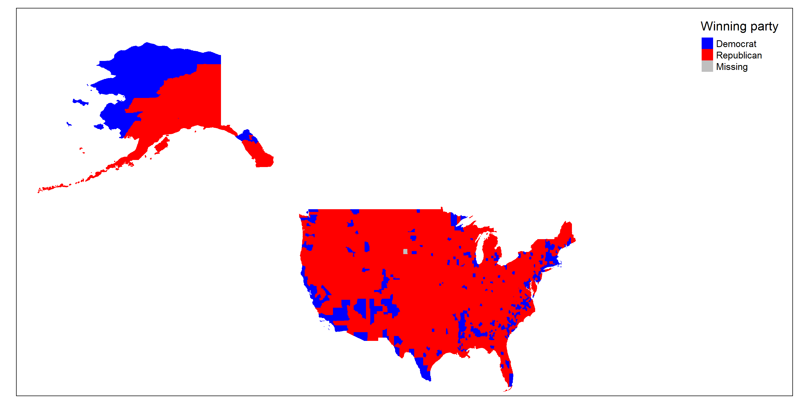

# More pictures!

#### Covariate Data Visualizations

##### Unemployment Rate by State over Time (January to July 2020)


##### Map of Results of 2016 Presidential Election Voting by County

##### Maps of Percent of COVID Deaths Due to Different Comorbidities
[Link to Shiny App](https://lrallen3.shinyapps.io/comorbidity_app)

#### Visualizing the work process

#### The team!

