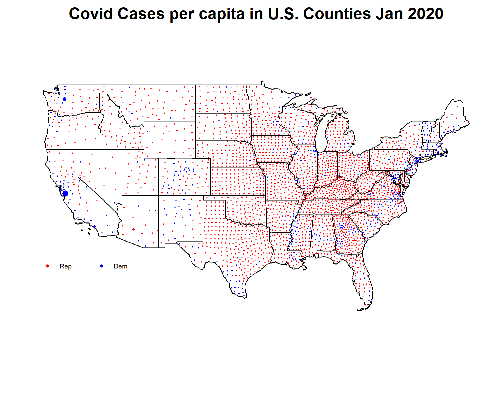

# COVID-19 and Politics
*Have places that voted for Trump in 2016 had better COVID-19 outcomes than those that voted for Clinton?*

President Trump recently remarked:

 *"If you take the blue states out, we're at a level that I don't think anybody in the world would be at. We're really at a very low level. But some of the states, they were blue states and blue-state-managed."*

We decided to spatially analyze these claims. The following map depicts political party victories (red/blue) and the rate of increase for confirmed covid cases in each U.S. county. From the time COVID-19 many local legislations enforced mass quarantine and business closings (March 2020), there are no signs of a notable disparity between covid case rate increase and county's popular party.

 

As part of NC State's Geospatial Data Mining graduate course, we fact checked President Trump’s statement by answering the question, *“did parts of the nation that voted for President Trump in 2016 have better outcomes regarding COVID-19 than areas which voted for Hillary Clinton?”* We considered three outcome metrics for COVID-19: deaths per capita, cases per capita and unemployment. We investigate if political sentiments among states and counties influenced the three COVID-19 outcomes by visually mapping and comparing to regional properties from geospatial, health and socio-economic variables.

##### Find our analysis, data and methods on github: 
  [GitHub](https://github.ncsu.edu/chaedri/Data-Challenge-GIS713)
